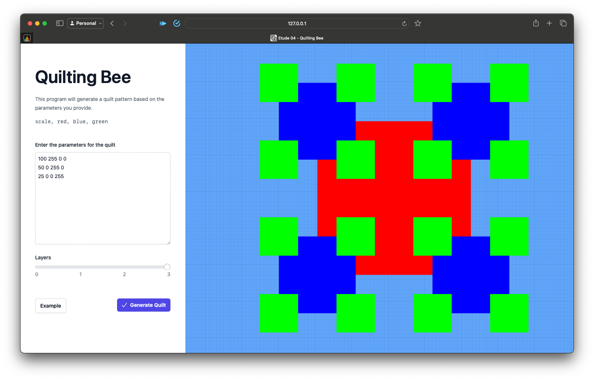

<!-- PROJECT LOGO -->
<br />
<p align="center">
    <h1 align="center"> Etude 04 - Quilting Bee </h1>
    <h6 align="center">James Robiony-Rogers</h6>
</p>

___


## Overview 
Write a program that produces a representation of a quilt design on the screen or as a graphics file in a common format. The input to the program will be a sequence of lines of the form:

```txt
scale, red, blue, green
```

where `scale` is a scale parameter for the current layer, and `r` `g` `b` are values from 0- 255 representing red, green and blue levels in the RGB scale.

## Project Extension
Featured below the field is a slider allowing the user to view the quilt at the different stages of completion ranging from incomplete to complete.

In addition I have implemented live quilt updates allowing the user to prototype their quilt design in real time. Along with this I have added a non-intrusive but helpful alert to notify the user of any errors in their input.

Finally I have added an example button that populates the input field with a pre-defined quilt pattern, displaying the quilt on the screen. 

### Running Locally

1. Visit the site hosted via Github Pages: [https://jamesrobionyrogers.github.io/Etude04-QuiltingBee](https://jamesrobionyrogers.github.io/Etude04-QuiltingBee/)

<!-- USAGE EXAMPLES -->
## View Project

<div align="center">
   
</div>

